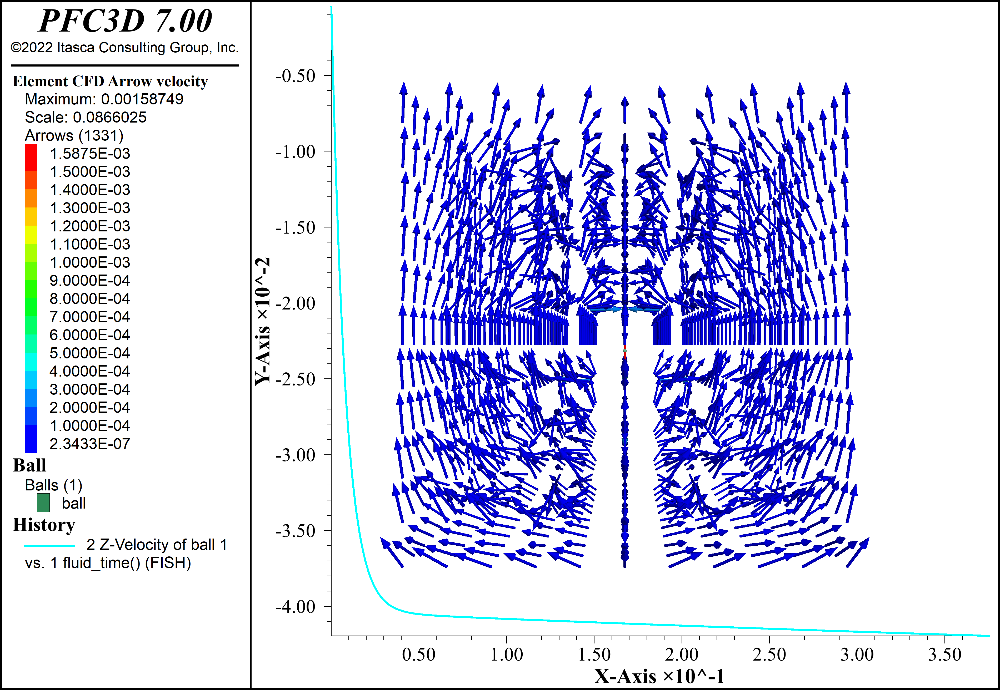

# Using *PFC3D* v700 with *OpenFOAM* v2112 for fluid-particle interaction modeling


The repository contains information about solving fluid-particle
interaction problems by coupling *OpenFOAM* based CFD solvers with
*PFC3D*. *OpenFOAM* is an open source C++ framework for numerical
analysis of continuum mechanics problems. Particle Flow Code in Three
Dimensions (*PFC3D*) is a discrete element code produced by Itasca
Consulting Group.

OPENFOAM® is a registered trade mark of OpenCFD Limited, producer and
distributor of the OpenFOAM software. This offering is not approved or
endorsed by OpenCFD Limited, producer and distributor of the OpenFOAM
software and owner of the OPENFOAM® and OpenCFD® trade marks.

Itasca Consulting Group does not provide support for *OpenFOAM*.

The two-way coarse-grid coupling between *PFC3D* and *OpenFOAM* follows
the approach of Tsuji. Porosity and body force fields are included in
the Navier-Stokes equation to account for the presence of particles in
the flow and these terms are linked to drag forces on the *PFC3D* particles.

A Python module `pyDemFoam` is included which contains modified
versions of the *OpenFOAM* `icoFoam` and `simpleFoam` solvers. These
solvers are modified to account for the presence of solid particles.
This package works for only the Ubuntu 20.04 LTS Linux distribution.

The following diagram gives an overview of the system.


# Installation

These instructions work for the x86_64 version of Ubuntu 20.04 LTS.

Make sure your Ubuntu system is updated:
```bash
sudo apt-get update && sudo apt-get upgrade
```

Update to the latest Linux version of *PFC3D* 7.00: https://www.itascacg.com/software/downloads/itasca-linux-software-7-0-update

bash```
wget https://itasca-software.s3.amazonaws.com/itasca-software/v700/itascasoftware_700.145.deb
sudo DEBIAN_FRONTEND=noninteractive apt-get -y install -f ./itascasoftware_700.145.deb
mkdir -p ~/.config/Itasca
touch ~/.config/Itasca/wad700.conf
echo "[weblicense]" >> ~/.config/Itasca/wad700.conf
echo "email=your email here" >> ~/.config/Itasca/wad700.conf
echo "password=your web license password here" >> ~/.config/Itasca/wad700.conf
```

Run the command line version of PFC3D v700
```bash
pfc3d700_console
```

Give the command `license list web` to make sure your web license is
working. Type `exit` to leave *PFC3D*. At this point, *PFC3D* should
be installed and working and we move into building OpenFOAM and the
coupling module.

Install some prerequisite packages:
```bash
sudo apt-get install python-is-python3 python3-numpy ipython3 cython3 python3-dev python3-pip git-core build-essential cmake libfl-dev bison zlib1g-dev qttools5-dev qtbase5-dev libqt5x11extras5-dev gnuplot libreadline-dev libncurses-dev libxt-dev libopenmpi-dev openmpi-bin libboost-system-dev libboost-thread-dev libgmp-dev libmpfr-dev libcgal-dev curl libglu1-mesa-dev
```

Install the `itasca` Python module with `pip install itasca`

## Building *OpenFOAM* v2112

This package and these instructions only work with OpenFOAM v2112.

What follows here is a distillation of the instructions from here:

https://openfoamwiki.net/index.php/Installation/Linux/OpenFOAM-7/Ubuntu/20.04

consult this link if you have problems.

First, download and unzip OpenFOAM v2112 with the following commands:

```bash
cd ~
mkdir OpenFOAM
cd OpenFOAM
wget https://dl.openfoam.com/source/v2112/OpenFOAM-v2112.tgz
tar -xzf OpenFOAM-v2112.tgz
ln -s /usr/bin/mpicc.openmpi OpenFOAM-v2112/bin/mpicc
ln -s /usr/bin/mpirun.openmpi OpenFOAM-v2112/bin/mpirun
```

These commands add the OpenFOAM shell environment settings needed to
build and use OpenFOAM. If you have a problem later make sure you did
this step correctly.

```bash
echo "source ~/OpenFOAM/OpenFOAM-v2112/etc/bashrc WM_LABEL_SIZE=64 FOAMY_HEX_MESH=yes" >> ~/.bashrc
. ~/.bashrc
```


```bash
cd $WM_PROJECT_DIR
export QT_SELECT=qt5

./Allwmake -j 12 > log.make 2>&1
```

At this point *OpenFOAM* should be built. Try `icoFoam -help` to
confirm.

## Building `pyDemFoam`

`pyDemFoam` is a Python module which contains modified versions of
*OpenFOAM* solvers. It includes porosity and body force terms to
account for the presence of the particles. Modified version of both
`icoFoam` and `simpleFoam` are provided.

```bash
cd
mkdir src
cd src
git clone https://github.com/jkfurtney/PFC3D_OpenFOAM.git

cd PFC3D_OpenFOAM/pyDemFoam/
python setup.py install --user
```

Test that this worked:

```bash
cd ~
python -c "import pyDemFoam; print pyDemFoam.__version__"
```

A version number number like: `2016.06.09` should be shown if the
installation worked correctly.

# Running coupled problems

Under Windows make a clone of this repository.

A demonstration and verification problem is included in the
`dropTest1/` folder.

#### In *PFC3D*

- Start *PFC3D* and open `dropTest1/dropTest1.p3prj`

- Run the file `pfc_dropTest1.py`

#### In Ubuntu:

```bash
cd ~/src/PFC3D_OpenFOAM/dropTest1/
blockMesh
python cfd_dropTest1.py
```

This should launch the coupled calculation.



# Limitations

This work is intended as a demonstration of how to connect *PFC3D* to
a CFD solver. The implementation given here is limited in the
following ways:

- No linear relaxation is used to stabilize the equations. Numerical
  instabilities are likely to occur.

- No turbulence model is included in the analysis.

- Time derivatives of porosity are not included in the momentum or continuity equations.

- Further verification of the coupled system is underway.

# More Information

Documentation for *OpenFOAM* can be found here:
http://cfd.direct/openfoam/documentation/

## Building a local copy of the *OpenFOAM* documentation

If you are exploring the *OpenFOAM* C++ code it is helpful to have a
local copy of the OpenFOAM C++ API documentation. GNU Global can help
navigating large source codes.

```bash
sudo apt-get install doxygen graphviz global
cd $WM_PROJECT_DIR/doc
./Allwmake
```

The Doxygen reference should be in `$WM_PROJECT_DIR/doc/Doxygen/html/index.html`

python setup.py install --user > log.txt 2>&1 && tail log.txt

## Other projects

* OpenFOAM LAMMPS coupling: https://github.com/xiaoh/sediFoam

* OpenFOAM YADE coupling: http://trace.tennessee.edu/utk_graddiss/21/
